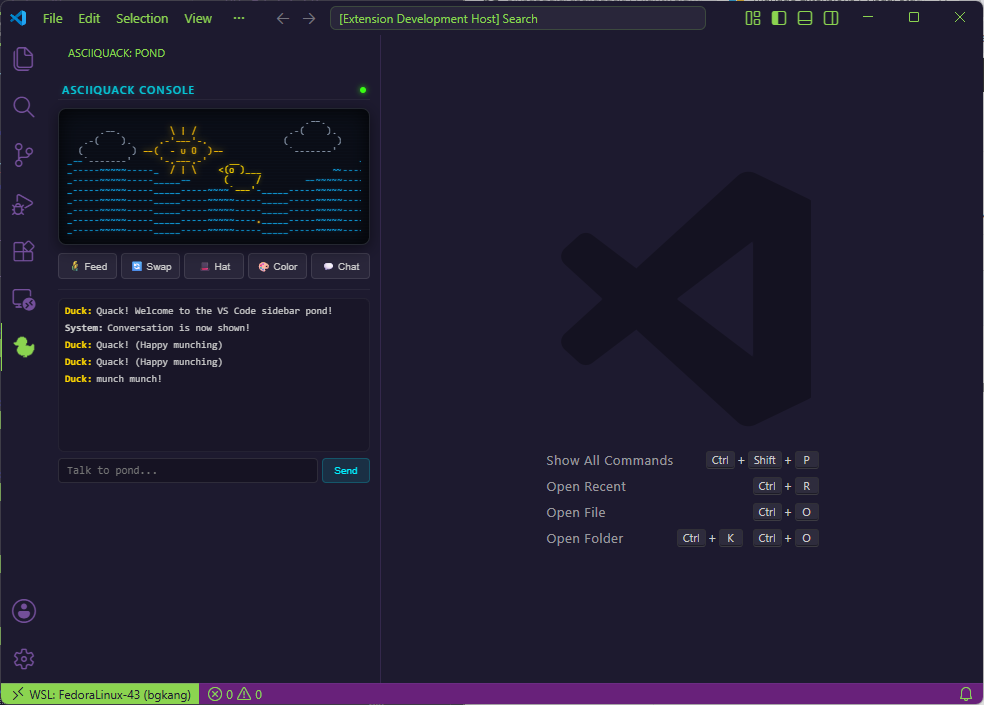

# asciiquack / asciifrog 🦆🐸🌊✨

A lightweight, zero-dependency terminal rubber-companion and **VS Code Sidebar Extension** for debugging, drifting, and dreaming.

```
      \ | /
    .-'---'-.
 --(   O u O   )--      .--.
    '-.---.-'        .-(    ).
      / | \         (         )
                     `-------'

      __             (o)(o)
    <(o )___        (  u   )    ~  -  _  -  ~
     (     /       (        )   -  _  -  ~  -
      `---'         `------'    _  -  ~  -  _
~~~~~~~~~~~~~~~~~~~~~~~~~~~~~~~~~~~~~~~~~~~~~~~
Talk to Frog/Duck (ESC: Quit | TAB: Color | H: Hat | F: Feed | A: Animal | C: Chat | M: Menu): _
```



Inspired by the classic `asciiaquarium`, this app brings a peaceful, floating rubber companion right into your workspace (featuring a special chibi frog mode for JY! 🐸💖). Run it as a **standalone Python TUI** in your terminal or install the [Asciiquack VS Code Sidebar Extension](https://marketplace.visualstudio.com/items?itemName=SinsuSquid.asciiquack) for the ultimate companion programming experience! 💖

---

## 🚀 Modes of Operation

### 📺 1. TUI Mode (Terminal User Interface)
Built entirely in Python 3.13 using the standard library and raw ANSI escape codes. Extremely lightweight, fast, and runs in any terminal emulator.

#### Quick Start:
```bash
git clone git@github.com:SinsuSquid/asciiquack.git
cd asciiquack
python3 main.py
```

#### Packaging as Binary:
You can package the TUI into a standalone executable using **PyInstaller**:
```bash
pip install pyinstaller
pyinstaller --onefile --name asciiquack main.py
```
Find your compiled binary in the `dist/` directory!

---

### 💻 2. VS Code Sidebar Extension Mode
A native VS Code extension that renders the pond in a dedicated Webview View in your Activity Bar. Re-coded in HTML/CSS/JS with:
- **Cyberpunk Dark Theme:** Neon-green frogs, gold-yellow ducks, and glowing text shadows.
- **CRT Scanline Effects:** A vintage digital screen texture overlaid on the pond.
- **Auto-fitting Horizontal Grid:** Automatically detects and scales the columns count (`gridWidth`) to match your VS Code sidebar width on resize, preventing horizontal scrollbars.
- **Draggable Vertical Resizer:** Drag the bottom border handle up or down (showing a double-sided `ns-resize` cursor) to manually resize the animation row height!
- **High-Performance Rendering:** Uses zero-allocation primitive arrays and a delta-time decoupled animation loop to keep waves running at a smooth, constant speed regardless of window scale.
- **Interactive UI Buttons:** Click buttons or use keyboard shortcuts to interact.

#### 🛒 Marketplace Installation:
Install it directly from the [VS Code Marketplace](https://marketplace.visualstudio.com/items?itemName=SinsuSquid.asciiquack), or search for `Asciiquack` in the Extensions view (`Ctrl+Shift+X`) inside your editor!

#### 📦 Local VSIX Installation:
Install the pre-compiled extension bundle directly into VS Code:
```bash
code --install-extension asciiquack-0.1.4.vsix
```

#### Launching in Development:
1. Open this repository in VS Code.
2. Run `npm install` to setup development types.
3. Press **`F5`** (or select **"Run Extension"** in the Debug panel) to launch the **Extension Development Host**.
4. Click the yellow pixel-art duck icon in the Activity Bar!

---

## 🎮 Controls & Shortcuts

The following keybindings work in both **TUI Mode** and **VS Code Extension Mode** (when the input field is not focused in the extension):

| Key / Control | Action |
| :--- | :--- |
| **`Enter`** / **Send** | Send a message to your companion |
| **`Tab`** / **🎨 Color** | Cycle colors (**Yellow ↔ Green ↔ Cyan ↔ Magenta ↔ Red ↔ White**) |
| **`H`** / **🎩 Hat** | Cycle through hats (**None, Top Hat, Cap, Flower, Crown, Beret, Wizard, Bow**) 🎩👑🎀 |
| **`F`** / **🌾 Feed** | Feed breadcrumbs to the pond 🥨 |
| **`A`** / **🔄 Swap** | Switch between animal species (**Duck ↔ Frog**) |
| **`C`** / **💬 Chat** | **Toggle Conversation Log:** Hides the console log and dynamically expands the pond animation height! |
| **`M`** / **🗺️ Menu** | **Toggle Menu:** Hides/shows the menu bar containing all keyboard shortcuts at the bottom of the screen! (TUI Mode only) |
| **`ESC`** | Exit the pond safely (TUI Mode only) |

---

## 🛠️ Tech Stack

- **Python 3.13+** & **Raw ANSI Escape Sequences** (TUI Engine)
- **Node.js**, **VS Code Extension API**, and **HTML5/CSS3/JavaScript** (VS Code Webview Engine)
- **PIL / Pillow** (For high-quality pixel art icon optimization)
- **Love and Animal Magic** 💖🦆🐸

---

*Made with ✨ by [SinsuSquid](https://github.com/SinsuSquid) and their loyal CLI Assistant.*
